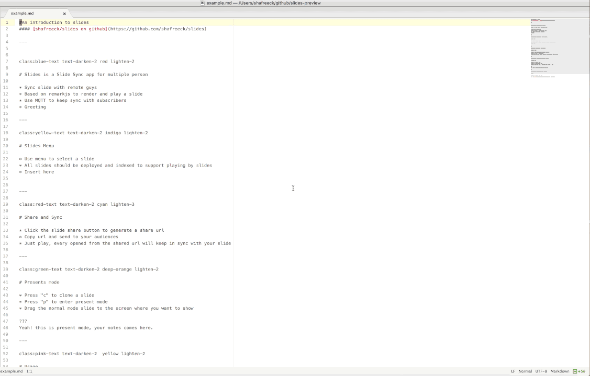

# slides-preview package

Slides-preview render you markdown into slides presentations using remarkjs

I have another project([slides](http://github.com/shafreeck/slides)) that share and sync slides with others.

